# Introdução a Jogos Digitais

## Aula 01 - 24/02/2025
### Definições
* Contexto: tudo aquilo inerente ao ambiente que o jogo passará, como ambiente, história, som, gráficos, jogabilidade.
* Objetivos: os jogos devem ter alguns objetivos para que seu usuário atinja, como a capacidade de pesquisa, raciocínio, conhecimento, aprendizado, interação, etc.
* Jogos: são programas específicos que possuem:
    - Alta frequência de atualização dos jgos e do display.
    - Interatividade e não linearidade (diferente de filmes e livros).
    - Conceito de "Mundo virtual" (imersão).
    - Executados em consoles, computadores, fliperamas, entre outros.
    - Utilizados para entreter, educar, aprender, treinar e divulgar produtos ou serviços.

### História
> Não realizei anotações acerca deste tópico, por não serem conceitos necessários para a matéria.

### Gameficação
É a prática de uso de jogos para tarefas com pouco apelo estimulate, como o aprendizado de linguas, com o Duolingo.

### Parte acadêmica
Algumas referências acadêmicas (com artigos científicos, etc):
- SBGames: simpósio brasileiro de jogos e entretenimento digital.
- IEEE transactions on games (artigos científicos).

### Desenvolvimento
- Arte e design
- Interface
- Música
- Computação
    - Algoritmos
    - IA
    - Estruturas de dados
    - Programação paralela
- Matemética e física
- Marketing e gerenciamento de projetos.

## Aula 02 - 10/03/2025

### PMBok
É um "livro" de especificações para a gestão de projetos.

### Projeto
É um conjunto de atividades com tempo determinado, destinada a produzir um produto ou serviço.

### Projeto vs. Processo
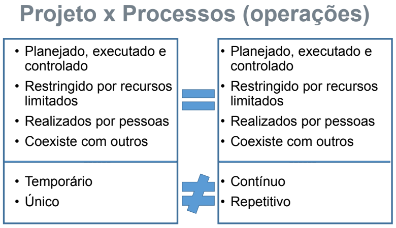

### Ciclo de vida
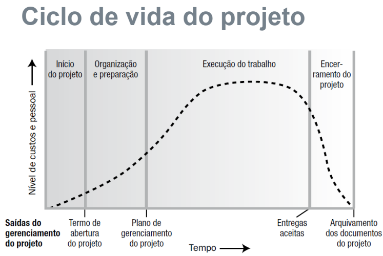
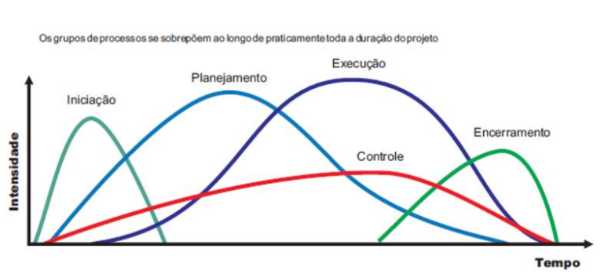

A ideia da segunda imagem é demonstrar que as etapas do projeto coexistem ao mesmo tempo. Por exemplo, o planejamento não termina antes de que o desenvolvimento seja iniciado.

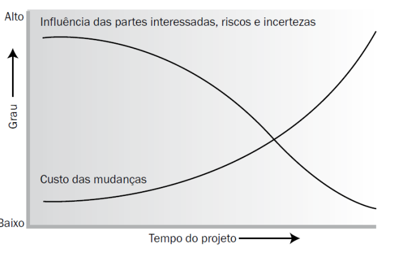

### Áreas do gerenciamento de projetos

- **Integração**: cada um do time é responsável por uma etapa, a fim de delegar funções e otimizar tempo.
- **Escopo**: determina as expectativas que o projeto deve suprir.
- **Tempo**: tempo de execução.
- **Custos**: valores que precisam ser gastos.
- **Qualidade**: como será julgada a qualidade da entrega, esperada pelos interssados no projeto e pelos integrantes da equipe.
- **Recursos humanos**: quais pessoas precisam ser 
- **Comunicações**: como será feita a comunicação entre o time.
- **Riscos**: deve-se avaliar os possíveis obstáculos para o projeto.
- **Aquisições**: aquilo que deve ser adquirido para a produção (máquinas, equipamentos, etc).
- **Partes interessadas**: são as pessoas interessadas diretamente no resultado do projeto.

### Tecnologias
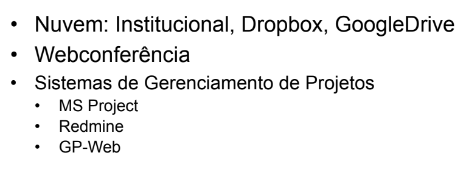

### Etapas da criação de jogos
> Imagens retiradas da apresentação do professor.
> 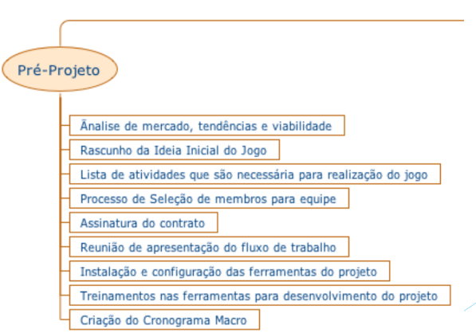
> 
> 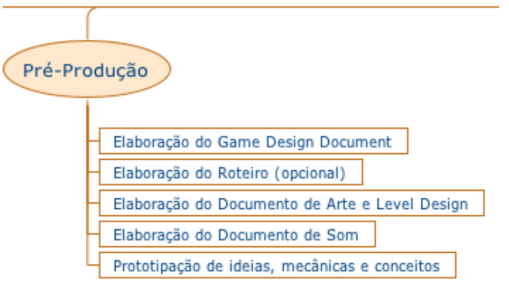
> 
> 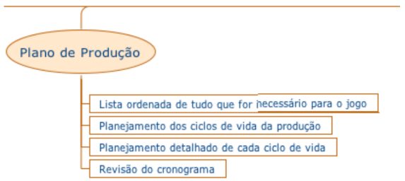
> 
> 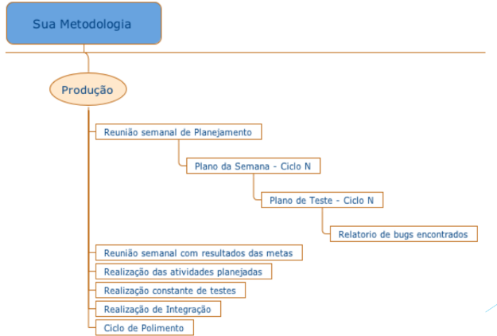
> 
> 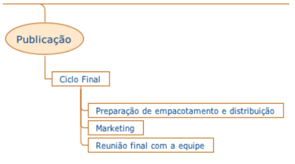
> 
> 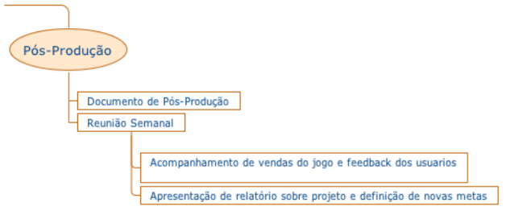
> 

