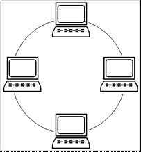
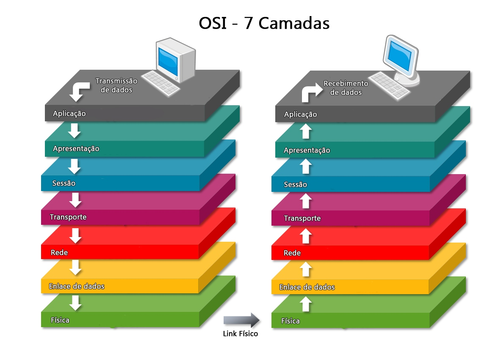
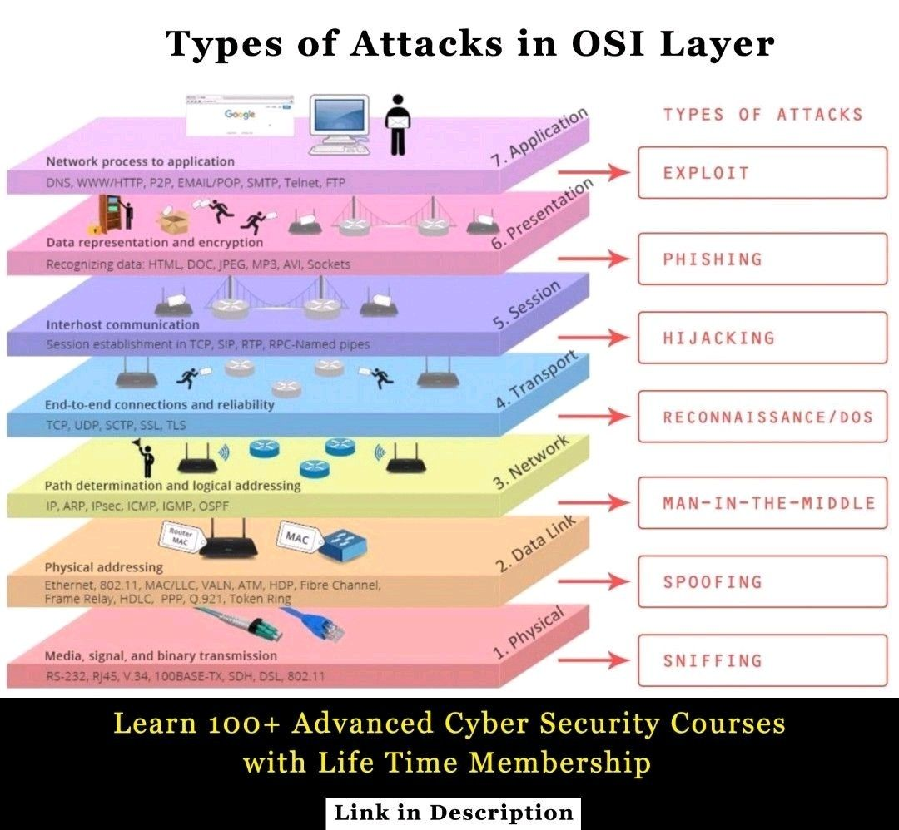
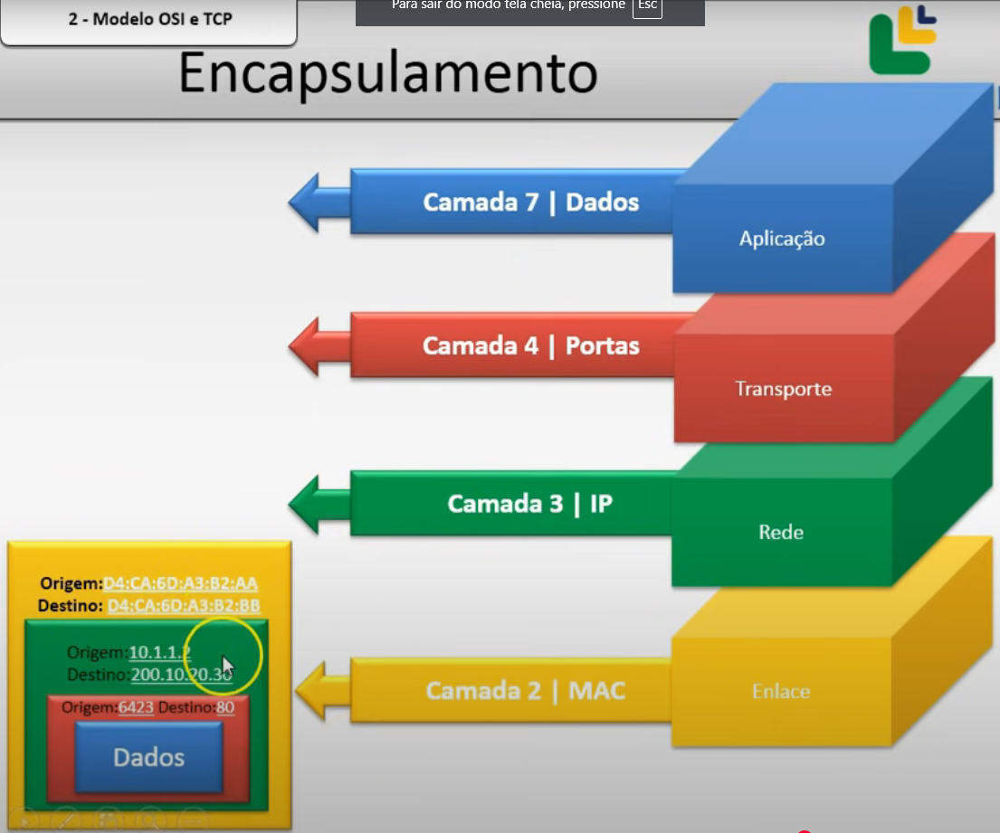
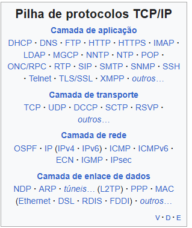
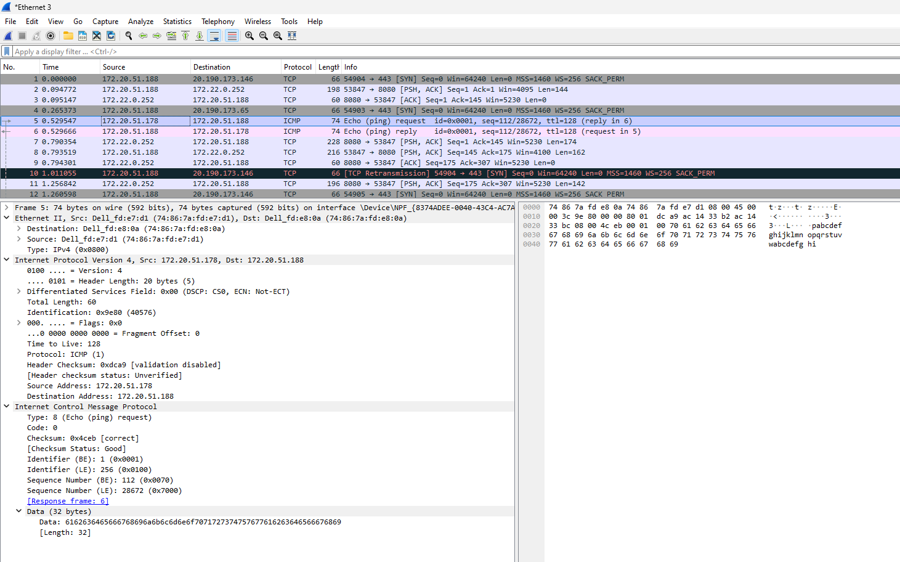
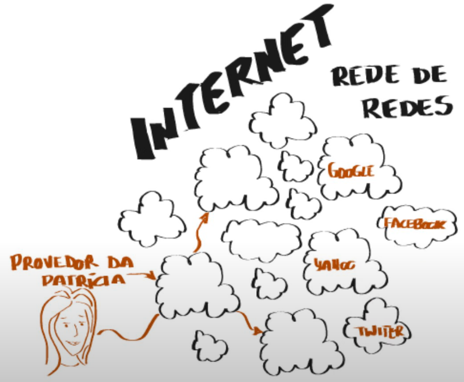
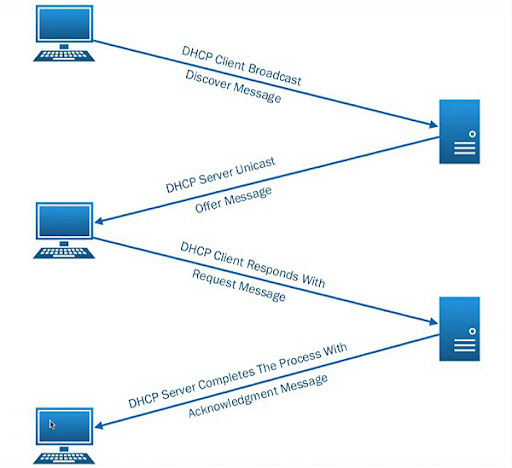

# Aula 1 - 18/02/2025
## História das redes de computadores

A primeira experiência com redes de computadores se deu em 1965 por Lawrence Roberts e Thomas Merril, um em na universidade em Massachusetts e outro na Califórnia.

A internet teve seu início em 1969, para uso militares e em universidades.

Em 1996, 30 mil pessoas tinham acesso a internet no Brasil.

## Comunicação
* Informação: texto, voz, imagem convertida em sinal digital ou analógico.
* Transmissão: smartphone, computador ou tablet que deseja enviar essa informação.
* Canal: meio em que a comunicação passa, pode ser pelo ar, fio de cobre ou fibra ótica.
* Receptor: computador, smartphone ou tablet que receberá a informação.
* Protocolo: conjunto de regras pré-definidas entre o emissor e o receptor.

## Definição de redes

Segundo Tenenbaum:
- Conjunto de módulos e processadores capazes de trocar informações e recursos entre si.
- Não há limite de participantes de uma rede.
- Ativos de rede são equipamentos que necessitam de eletricidade para atuar na rede.*
- Passivos de rede são dispositivos que não necessitam de energia.*

> \* Definição simplificada, não definitiva.

## Tipos de rede
O primeiro tipo de rede é o ponto a ponto (P2P), onde os integrantes da rede compartilham informações e recursos entre si, sem a necessidade da centralização (em um servidor, por exemplo) do dado.

> "O Torrent é um exemplo de comunicação ponto a ponto".

O outro tipo é a rede cliente/servidor, onde os dispositivos (clientes) tem acesso a informação e recursos compartilhados que estão centralizados em um servidor (host).

## Redes determinísticas e não determinísticas

Nas determinísticas, há o controle de tempo para a inserção de informações na rede.

Contrária à primeira, as não determiníticas não possuem controle de tempo, cada host pode enviar suas informações na quantidade que quiser e na hora que quiser.

> É como se a determinística fosse uma partida de volei comum, e a não determinística é uma partida de vôlei com inúmeras bolas sendo utilizadas ao mesmo tempo.

## Topologia de rede

É a disposição física o qual se conecta os nós (componentes da rede) de uma rede mediante a combinação de padrões e protocolos.

### Barramento
Todos os dispositivos recebem a informação que era destinada à um dos dispositivos, dado que estão interligados pelo mesmo cabo. O dispositivo ao qual a informação não é o destino, ignora os pacotes recebidos.
A desvantagem é a lentidão, segurança e fragilidade da rede, dado que o rompimento em qualquer local do cabo, tornará todos os dispositivos offline.


### Estrela
Nesta topologia, os dispositivos da rede são interligados em um nó central.
A vantagem é que os dispositivos são independentes, porém, um problema no nó central pode parar a rede toda.


### Anel
Cada dispositivo é interligado com outros dois dispositivos. A vantagem é que um dispositivo será isolado da rede somente se a comunicação com os dois dispositivos falhar.



### Estrela estendida
É uma evolução da topologia estrela, com vários nós centralizadores, que por si, são centralizados em outro nó.


### Topologia completa
Por fim, na topologia completa, todos os nós são interligados entre si.
A comunicação é mais rápida e direta, porém, é uma topologia que apresenta maiores custos de desenvolvimento e manutenção.


### Exemplo prático
Na FHO, os laboratórios possuem a topologia estrela. Entre os laboratórios dos prédios, temos a estrela estendida. Entre os prédios e o servidor central, temos a topologia anel.

## Abrangência de redes
Para a classificação das redes é considerado o tipo de conexão e a amplitude geográfica.
- PAN (Personal Area Network): rede que conecta dispositivos pessoais, como o _smartphone_ e o fone de ouvido.
- LAN (Local Area Network): abrange um prédio ou campus.
- MAN (Metropolitan Area Network): abrange uma cidade.
- WAN (Wide Area Network): abrange o espaço de um país.

A internet é a conexão entre as "ANs", em ordem decrescente de tamanho geográfico.

---

# Aula 2 - 25/02/2025
## Modelo de Referência OSI (ISO 7498)
- É um modelo de referência que dita algumas regras (padrões) a respeito da comunicação entre dispositivos de diferentes tecnologias, hardware e softwares.




> Das camadas 1 a 3, estamos tratando de hardwares.
> O TCP/IP é uma implementação das camadas OSI.

### Camada Física
- Responsável pela transmissão dos _bits_ através do meio.ls
- É a camada que faz a leitura dos pulsos no meio de transmissão, como os do cabo de rede.
- Tópicos envolvidos:
    - Topologia (estudada na aula passada);
    - Meios de transmissão (estudada na aula passada);
    - Sentido de transmissão (simples, half-duplex e full-duplex);
    - Sincronismo;
    - Dentre outros.

### Camada de Enlace
- É a camada que lida com o tráfego de quadros (grupo de bits) transmitidos.
> Ela une alguns bits e grupos, chamadas de quadros ou frames.
- Nela, também é determinada as formas de controle de acesso ao meio de transmissão.
- Os dados nesta camada ainda são desfigurados.
- Ela determina, através de um bit de controle, se a comunicação entre o receptor e o emissor está corrompida ou não. Caso o bit de controle não seja recebido por uma das partes, ela solicita o valor novamente ao emissor.
- Tópicos envolvidos:
    - Controle de acesso ao meio: token, CSMA, CSMA/CD, etc.
    - Técnicas de controle de erros: paridade, check sum, CRC, etc.

> Um CRC é um mecanismo de detecção de erro comumente usado em redes de computador e de armazenamento para identificar dados alterados ou corrompidos durante a transmissão. - Cisco.

### Camada de Rede
- Padroniza e define os endereços das máquinas da rede de coputadores.
- Gere o tráfego e rotas da rede.

### Camada de Transporte
- Transição (conversão) entre o software e o hardware.
- Abstrai a evolução dos hardwares para não afetar as camadas superiores.
- Valida se a informação recebida ou enviada está completa, antes ou após o empacotamento para transmissão.

### Camada de Sessão
- Permite que usuários possam estabelecer sessões entre as máquinas da rede.
- Nela, também é tratada a etapa de sincroninismo da comunicação, caso tenha havido alguma oscilação no processo.
- Gerenciamento de atividades (transações).

### Camada de Apresentação
- E uma camada de tradução dos dados, chamada de codificação, para o uso da próxima camada.
- Realiza uma criptografia básica do dado.
- Compacta os dados.

### Camada da Aplicação
- Esta camada oferece o acesso as aplicações que estão sendo executadas nos computadores ligados na rede.

### Exemplo prático
> Conteúdo retirado do [GeekForGeeks](https://www.geeksforgeeks.org/open-systems-interconnection-model-osi).

Let us suppose, Person A sends an e-mail to his friend Person B.

Step 1: Person A interacts with e-mail application like Gmail, outlook, etc. Writes his email to send. (This happens at Application Layer).

Step 2: At Presentation Layer, Mail application prepares for data transmission like encrypting data and formatting it for transmission.

Step 3: At Session Layer, there is a connection established between the sender and receiver on the internet.

Step 4: At Transport Layer, Email data is broken into smaller segments. It adds sequence number and error-checking information to maintain the reliability of the information.

Step 5: At Network Layer, addressing of packets is done in order to find the best route for transfer.

Step 6: At Data Link Layer, data packets are encapsulated into frames, then MAC address is added for local devices and then it checks for error using error detection.

Step 7: At Physical Layer, Frames are transmitted in the form of electrical/ optical signals over a physical network medium like ethernet cable or WiFi.

After the email reaches the receiver i.e. Person B, the process will reverse and decrypt the e-mail content. At last, the email will be shown on Person B email client.

---

# Aula 3 - 11/03/2025

## Modelos TCP/IP
- Ele é a implementação do modelo de referência OSI.
- Dentro das camadas do TCP/IP, cada protocolo tem a sua porta padrão por convenção. Exemplo: SMTP: 25 ou 587.
- O modelo é formado por quatro camadas.


> Protolocos por camada  
> 

> Exemplo prático apresentado pelo professor
>   - Aplicação: dado bruto que será transmitido na rede.
>   - Transporte: o dado será encapsulado com os dados das portas do protocolo que será usado (TCP ou IP).
>   - Rede: onde os dados serão encapsulados novamente, com os endereços IP do emissor e receptor.
>   - Enlace: onde será feito o encapsulamento com o endereço MAC, para a transmissão.

### Aplicação
Nesta camada estão as aplicações que serão utilizadas pelo usuário para realizar a comunicação. Elas fazem o uso das camadas para a comunicação em rede.

### Transporte
- É a camada responsável pela transferência de dados entre duas máquinas.
- A camada de transporte oferece para o nível de aplicação um conjunto de funções e procedimentos para o acesso ao sistema de comunicação de modo a permitir a criação e a utilização de aplicações de forma independente da implementação da rede. As interfaces dos sistemas operativos, como o socket ou TLI (Unix) e Winsocket (Windows) fornecem um conjunto de funções-padrão para permitir tal acesso (driver da placa de rede).
- Principais protocolos desta camada: UDP (não orientada a conexão) e TCP (orientada a conexão).

* TCP (Transmission Control Protocol)
    - Controla o fluxo para que não hajam congestionamentos na comunicação, refaz a transmissão de datagramas falhos e faz a ordenação dos pacotes que foram transmitidos.
    - Usamos ele quando precisamos garantir que a informação chegará completa no destino.
    - O protocolo faz o uso do bit de verificação para saber se o dado está completo ou não.

* UDP (User Datagram Protocol)
    - Não controla fluxo.
    - Não faz o reenvio em caso de falhas.
    - Não realiza a ordenação dos dados.
    - Protocolo mais rápido, devido ao fato de não haver validação do dado estar completo.
    - O Skype é um exemplo que implementa o uso deste protocolo.

### Internet
- Responsável pelas permissões do envio dos pacotes e garantia de que os dados cheguem ao destino final.
- Realiza o roteamento entre os equipamentos da rede.
- Protocolos: IP e ICMP.

* IP (Internet Protocol)
    - Realiza roteamento e endereçamento de pacotes de dados para que eles possam viajar pelas redes e chegar ao destino correto.
    - Ele atribui um endereço exclusivo, dentro da rede, para cada equipamento, a fim de que ele possa ser encontrado, para completar o processo de comunicação.
    - Utiliza 32 bits para representar o endereço da máquina, de acordo com o IPv4.

* ICMP (Internet Control Message Protocol)
    - Utilizado para determinar se o host está acessível.

> O comando `ping` utiliza o protocolo ICMP para verificar se um host está disponível. Ao utilizá-lo, chegamos até a segunda camada do TCP.
> ```
> C:\Users\ARS_USER_B10L1_10>ping 172.20.51.178
> 
> Disparando 172.20.51.178 com 32 bytes de dados:
> Resposta de 172.20.51.178: bytes=32 tempo=1ms TTL=128
> Resposta de 172.20.51.178: bytes=32 tempo=1ms TTL=128
> Resposta de 172.20.51.178: bytes=32 tempo=1ms TTL=128
> Resposta de 172.20.51.178: bytes=32 tempo=1ms TTL=128
> 
> Estatísticas do Ping para 172.20.51.178:
>   Pacotes: Enviados = 4, Recebidos = 4, Perdidos = 0 (0% de
>             perda),
> Aproximar um número redondo de vezes em milissegundos:
>     Mínimo = 1ms, Máximo = 1ms, Média = 1ms
> ```

> Com o Wireshark, podemos analisar todo o conteúdo que entra e sai do computador.
> Exemplo de um ping que foi feito na minha máquina no laboratório:
> 

### Enlace
TODO

> [Indicação do professor](https://www.youtube.com/watch?v=HNQD0qJ0TC4&pp=ygUHTklDSy5CUg%3D%3D).

---

# Aula 4 - 18/03/2025

<TODO>

- Protocolos: Ethernet, SFP, 1000 base x e 802.11 (a, b, g, n e ac).

---

# Aula 5 - 25/03/2025 - Protocolos da camada de Internet do TCP/IP
[Como funciona a Internet? Parte 2: Sistemas Autônomos, BGP, PTTs.](https://www.youtube.com/watch?v=C5qNAT_j63M&list=PLk5G8sJqhL_lNcPdhzVUBb_frxI5jnf7G&index=2)
[Introdução ao roteamento de pacotes IP](https://www.youtube.com/watch?v=y9Vx5l-th9Y)

## Sistemas Autônomos
Os sistemas autônomos são as grandes redes que, combinada aos outros sistemas autônomos, formam a internet.


Esses sistemas se ligam com base em acordos comerciais, entre empresas e países, por exemplo.

> "A internet é a ligação de várias WANs".

## Protocolos de roteamento da camada de rede/internet
Os protocolos são separados pelo tipo da rede em questão.

### ISIS
<TODO>

### EGP
- Utilizado para a comunicação entre os ASes.

### BGP
- Cria uma tabela que lista as rotas para interligar os sistemas autônomos (redes).
- Utilizado para a comunicação entre os ASes.

### ICMP
- Utilizado para determinar se o host está acessível.

### RIP
Utilizado para o roteamento de roteadores de borda (aquele que fica na provedora de internet). Baseia-se no algoritmo vetor-distância.

### OSPF
É um protocolo para o roteamento dinâmico entre os roteadores de borda (assim como o RIP), porem, utiliza sempre o caminho mais curto. Utiliza o algoritmo de Dijkstra.

## Protocolos da camada de aplicação
### DHCP
Este protocolo dita a configuração dinâmica de endereços IPs. Por meio do serviço de DHCP, que implementa o protocolo, é atribuído para cada equipamento participante da rede, um endereço único (dentro da rede) de IP.
O serviço do DHCP fica hospedado em um servidor, onde utilizamos o recurso.

A imagem a seguir mostra o procedimento.


### DNS
Ele é responsável por resolver os domínios, determinando o endereço IP do serviço que está sendo acessado.
[Como funciona a Internet? Parte 3: DNS](https://www.youtube.com/watch?v=ACGuo26MswI).

> No endereço `fho.edu.br`, está oculto o "." no final do endereço. Na resolução do DNS, cada servidor redireciona a resolução, da esquerda para a direita, para outro servidor que contem a informação

### FTP/SFTP
São protocolos para transferência de arquivos.

### SSH
Protocolo para o acesso à prompts de comando remotos.

### RDP
Protocolo de acesso remoto para os ambientes Windows.

### SNMP
É um protocolo utilizado para o monitoramento do equipamento de redes.

### IMAP
Protocolo para o recebimento e-mail.

### POP3
Semelhante ao IMAP, porém, o recebimento é feito através do download dos e-mails do servidor para a máquina do usuário.

### SMTP
Protocolo para o envio de e-mails.

> 

### HTTP
Protocolo utilizado para a transmissão de hipertexto e hipermídia.

### HTTPS
Este protocolo fornece a transmissao de hipertexto e hipermidia tambem, porém, utiliza criptografia.

### NTP
Utilizado para a sincronização de data e hora nos equipamentos da rede.

## Protocolos de enlace
### Ethernet
protoclo de conexão que garante como os hardwares se comunicam através do meio físico.

### ARP
Resolve o IP com base no MAC.

### PPP
<TODO>

---

# Aula 6 - 01/04/2025 - 

## Multiplexação de sinais

A multiplexação de sinais é a transmissão de informações simultâneas por um mesmo canal. Neste cenário, as informações que precisam chegar ao destinatário são segmentadas, e transmitidas juntas.


## NTP
Como citado anteriormente, o NTP é responsável pela sincronização de data e hora entre equipamentos na rede. O Brasil possui seu próprio servitor, o NTP.br.
[Vídeo da NIC.BR](https://www.youtube.com/watch?v=hyCrd0x2yGg)

## Governança
[Vídeo NIC.BR](https://www.youtube.com/watch?v=ZYsjMEISR6E)

---

Aula 7 - 08/04/2025 - Revisão (correção) dos exercícios

1) Explique as quatro principais topologias de redes
- Estrela
- Estrela estendida
- Anel
- Barramento: não é viável pois permite a ocorrência de muitos conflitos na rede.
- Completa: não é viável de implementar pois o custo é muito alto. Nesta topologia, todas as máquinas são ligadas a todas as máquinas.

2) Para se ter acomunicação em redes de computadores do que precisamos? Explique cada um dos elementos.
- Emissor: são computadores, tablets, smartphones, smarttv, switches.
- Receptor: são computadores, tablets, smartphones, smarttv, switches.
- Canal de comunicação: por onde a informação e transmitida, como cabo de redes, rádio, etc.
- Protocolo de comunicação: é o acordo entre o emissor e receptor sobre como será transmitida a informação.

3) Quais os tipos de redes que existe? Explique cada um deles.
- P2P: rede ponto-a-ponto, em que dois dispositivos se comunicam diretamente para a troca da informação. Um exemplo é o uTorrent.
- Cliente-servidor: neste tipo, a comunicação é intermediada através de um servidor, que irá fornecer os recursos solicitados para os clientes da rede. Exemplo: ao acessar o YouTube, a Google é o servidor, e o nosso smartphone é o cliente.

4) Explique como é estruturada a internet.
- LAN: rede local da nossa casa.
- MAN: redes que abrangem as cidades.
- WAN: redes que abrangem os continentes.
A internet são várias WANs, MANs e LANs conectadas.

5) Cite pelo menos uma característica importante de cada uma das camadas do modelo OSI.
Respondida na 9.
> Essa vai cair na prova!!!!

6) Explique como é feito o encapsulamento do TCP/IP.  
O TCP/IP é formado por quatro camadas. Através dele, a informação é encapsulada para ser transmitida.
Cada camada corresponde a uma parte no processo de transformação da informação em bits.
Ele funciona através de uma pilha de protocolos que são utilizados para encapsular as informações, para que ela seja transmitida na rede, em 0 e 1, para que seja remontada no receptor.

7) Na camada de Enlace do modelo OSI, explique como é o funcionamento dela.  
Ela é a segunda camada do modelo OSI. A camada física, que é a primeira, trabalha com a transmissão dos dados, em bits. Já a camada de enlace, trabalha com frames (um conjunto de bits recebidos pela camada física).

8) No modelo TCP/IP temos uma camada que é repsonsável pelo envio da informação, qual é essa camada, e quais são os tipos de protocolos de envio de informações? Explique cada um deles.  
É a camada de transporte. Os protocolos são TCP e UDP:
- TCP: é o protocolo seguro do envio de informações, dado que ele aguarda a confirmação de que a informação foi recebida completamente, sem perdas.
- UDP: neste protocolo, não há a verificação se a informação foi recebida completamente.

> Essa vai cair na prova.

9) Explique as 7 camadas do modelo OSI.  
(Listamos sempre de baixo para cima)
    1. Física: camada responsável por transmitir os bits na rede.
    2. Enlace: responsável por agrupar os bits em frames.
    3. Rede: responsável por definir as rotas de transmissão (roteamento) da informação. No sentido contrário das camadas, ela é responsável por averiguar se o dispositivo é o destino da informação
    4. Transporte: irá averiguar o tamanho dos frames para a camada de redes para que o roteamento possa ser feito na camada 3. Ela faz a conversão de software para hardware (e vice-versa).
    5. Sessão: responsável por estabelecer a sessão entre o emissor e o receptor.
    6. Apresentação: responsável por criptografia e compressão da informação.
    7. Aplicação: camada de acesso às aplicações (softwares) que irão compartilhar as informações na rede.

10) Explique a relação do modelo OSI com o TCP/IP.  
O modelo OSI é conceitual de redes, que serve de estudo.
O modelo TCP/IP é uma implementação da camada OSI, baseada em uma pilha de protocolos.

---

1. Explique a diferença entre a camda de Rede e Transporte.  
A camada de Redes é responsável por criar as rotas corretas para a transmissão dos pacotes.  
A camada de transporte é responsável por converter as informações de software para hardware e verificar o tamanho máximo dos pacotes que podem ser transmitidos na rede.

2. Explique como acontece a transformação da informação em bit segundo o modelo OSI.  
Primeiramente, ocorre a compressão e criptografia da informação. Em seguida, ocorre a repartição da informação em frações cada vez menores, até que se chegue nos bits.

3. Explique a camda de enlace de rede.  
Esta camada é do TCP/IP, responsável por utilizar os protocolos para a transmissão das informações no formato de bits através do meio físico (cabo de rede, fibra óptica, wifi, etc.).

4. Pensando no modelo OSI da camda 7 para a 1, qual é a primeira camada que trata do hardware? Explique ela.  
Transporte: ela é a primeira camada que possui acesso ao hardware. Ela é responsável por fazer a conversão de software para hardware e determinar o tamanho máximo de bytes que podem ser transmitidos na rede.

---

1) Conforme a última aula, explique ao menos 1 protocolo de cada camada do modelo TCP/IP.  
- Aplicação: RDP (protocolo d econexão remota à interfaces de dispositivos Windows, usa o TCP, na porta 3389), HTTPS (transferência de hipertexto mais segura, usa o TCP, porta 443), HTTP (transferência de hipertexto, usa o TCP, porta 80), SSH (protocolo de conexão remota a terminais, usa o TCP, porta 22) e SMTP (protocolo de envio de e-mails, usa o TCP, nas portas 25 e 587).
- Transporte: TCP (há confirmação da chagada da informação) e UDP (não há a confirmação).
- Internet ou Rede: OSPF (protocolo de roteamento inteligente, usa o algoritmo Dijkstra para buscar a melhor rota ), RIP (utilizado no roteamento estático entre roteadores), BGP (protocolo de roteamento entre ASes).
- Físico ou enlace de rede: Ethernet (padrão do rj45), SFP (fibra óptica), PPP, PPPOe, 802.11 (rádio frequência).

> Vai cair na prova!!!

2) O protocolo SNMP é utilizado para qual finalidade, cite um exemplo da usa utilização.  
Protocolo da camada de aplicação para o monitoramento de equipamentos da rede. Ele realiza a verificação dos dispositivos da rede para verificar se eles estão acessíveis. Utiliza o protocolo UDP, dado que não precisa aguardar o retorno para saber se a informação foi perdida, dado que a consulta é feita várias vezes. A porta padrão do SNMP é a 161.

3) Com relação a protocolos da camada de roteamento, existe um protocolo que utiliza um algoritmo para encontrar a melhor rota, qual o nome dele, explique como ele funciona e qual topologia de rede comumente é utilizado.  
OSPF. Ele utiliza o algoritmo de busca Dijkstra para encontrar a melhor rota na rede. A topologia de rede anel é comumente utilizada com este algoritmo, dado que ela permite que hajam dois caminhos para chegar ao destino, permitindo que o algoritmo escolha o mais rápido.

> Vai cair na prova!!!

4) Na camada de aplicação, é utilizado diversos protocolos, e cada um deles em sua porta padrão. Cite ao menos 3 protocolos, para que servem e qual a porta padrão dele.  
- DNS: responsável por resolver IPs com base em domínios. Usa o TCP na porta 53.
- NTP: responsável por fazer a sincronização de data e hora na rede. Usa o UDP na porta 123.

> Vai cair na prova!!!

5) O protocolo BGP é utilizado para roteamento, de qual forma?
O BGP é utilizado para fazer o roteamento entre os ASes. O IGP faz o roteamento interno entre os ASes.

6) Com base no modelo TCP/IP podemos ter protocolos da camada de acesso a rede, qual o padrão de protocolo de acesso a rede para comunicação de radio frequência utilizando 5 Ghtz? Explique.  
802.11 ac, ela permite a comunicação com mais de 1 Gbps, embora forneça alcançe menor.

7) Em uma rede existem protocolos como serviço, que se tornam essenciais em uma rede, para o seu funcionamento, cite ao menos um deles e explique.  
- TCP: é o protocolo que possui confirmação da informação enviada.
- DNS: é o protocolo que traduz o nome do domínio para IP. Usa o TCP na porta 53.
- DHCP: é o protocolo que dissemina os endereços IPs na rede.

8) No modelo TCP/IP existem dois principais protocolos de transporte, explique cada um deles, e de exemplo. Complemente mencionando um protocolo de aplicação que utiliza cada um deles.
- TCP: envia a informação e aguarda a confirmação do recebimento. Um exemplo de utilização é o download de arquivos. Protocolos que usam o TCP: http, smtp, ftp, sftp.
- UDP: envia a informação e não aguarda confirmação. Um exemplo são chamadas como pelo Whatsapp e Skype. Protocolos que usam o UDP: NTP, SNMP.

---

## Revisão da aula prática.

- Tipos de cabo de redes: UTP e STP (possui blindagem).
- Categorias dos cabos de rede: cat5 (máx 100 Mbps) e cat6 (máx 1Gbps)
- Cabos de rede não podem exceder 100 metros.
- Padrão de conectores: 568A e 568B. Existem dois padrões pois na comunicação ponto a ponto, o TX e o RX precisam ser invertidos. Quando um cabo possui uma ponta em cada um dos padrões, dizemos que ele está em crossover.
- Padrão de fibra óptica: multimodo (MM), utilizada para curtas distâncias e cabeamentos externos entre construções. Possui o núcleo maior; monomodo (SM) utilizada para longas distâncias, como atravessar a cidade, por exemplo. Possui o núcleo menor.
- Ativos de rede e tudo aquilo que necessita de energia elétrica para funcionar (como computadores). Passivos são os que não precisa (como cabo de rede e fibra óptica).
- O HUB trabalha na camada 2 do modelo OSI, portanto, não sabe quem são os destinatários da informação. O Switch trabalha, pelo menos, na camada 3, dado que conhece o destinatário da informação.