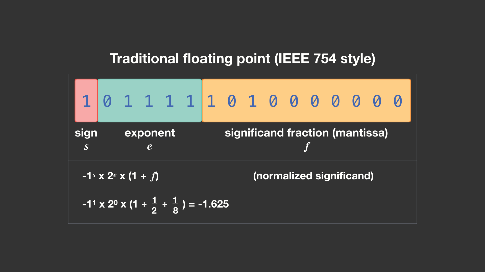

# Aula 1 - 18/02/2025
## História das redes de computadores

A primeira experiência com redes de computadores se deu em 1965 por Lawrence Roberts e Thomas Merril, um em na universidade em Massachusetts e outro na Califórnia.

A internet teve seu início em 1969, para uso militares e em universidades.

Em 1996, 30 mil pessoas tinham acesso a internet no Brasil.

## Comunicação
* Informação: texto, voz, imagem convertida em sinal digital ou analógico.
* Transmissão: smartphone, computador ou tablet que deseja enviar essa informação.
* Canal: meio em que a comunicação passa, pode ser pelo ar, fio de cobre ou fibra ótica.
* Receptor: computador, smartphone ou tablet que receberá a informação.
* Protocolo: conjunto de regras pré-definidas entre o emissor e o receptor.

## Definição de redes

Segundo Tenenbaum:
- Conjunto de módulos e processadores capazes de trocar informações e recursos entre si.
- Não há limite de participantes de uma rede.
- Ativos de rede são equipamentos que necessitam de eletricidade para atuar na rede.*
- Passivos de rede são dispositivos que não necessitam de energia.*

> \* Definição simplificada, não definitiva.

## Tipos de rede
O primeiro tipo de rede é o ponto a ponto (P2P), onde os integrantes da rede compartilham informações e recursos entre si, sem a necessidade da centralização (em um servidor, por exemplo) do dado.

> "O Torrent é um exemplo de comunicação ponto a ponto".

O outro tipo é a rede cliente/servidor, onde os dispositivos (clientes) tem acesso a informação e recursos compartilhados que estão centralizados em um servidor (host).

## Redes determinísticas e não determinísticas

Nas determinísticas, há o controle de tempo para a inserção de informações na rede.

Contrária à primeira, as não determiníticas não possuem controle de tempo, cada host pode enviar suas informações na quantidade que quiser e na hora que quiser.

> É como se a determinística fosse uma partida de volei comum, e a não determinística é uma partida de vôlei com inúmeras bolas sendo utilizadas ao mesmo tempo.

## Topologia de rede

É a disposição física o qual se conecta os nós (componentes da rede) de uma rede mediante a combinação de padrões e protocolos.

### Barramento
Todos os dispositivos recebem a informação que era destinada à um dos dispositivos, dado que estão interligados pelo mesmo cabo. O dispositivo ao qual a informação não é o destino, ignora os pacotes recebidos.
A desvantagem é a lentidão, segurança e fragilidade da rede, dado que o rompimento em qualquer local do cabo, tornará todos os dispositivos offline.

### Estrela
Nesta topologia, os dispositivos da rede são interligados em um nó central.
A vantagem é que os dispositivos são independentes, porém, um problema no nó central pode parar a rede toda.

### Anel
Cada dispositivo é interligado com outros dois dispositivos. A vantagem é que um dispositivo será isolado da rede somente se a comunicação com os dois dispositivos falhar.

### Estrela estendida
É uma evolução da topologia estrela, com vários nós centralizadores, que por si, são centralizados em outro nó.

### Topologia completa
Por fim, na topologia completa, todos os nós são interligados entre si.
A comunicação é mais rápida e direta, porém, é uma topologia que apresenta maiores custos de desenvolvimento e manutenção.

### Exemplo prático
Na FHO, os laboratórios possuem a topologia estrela. Entre os laboratórios dos prédios, temos a estrela estendida. Entre os prédios e o servidor central, temos a topologia anel.

## Abrangência de redes
Para a classificação das redes é considerado o tipo de conexão e a amplitude geográfica.
- PAN (Personal Area Network): rede que conecta dispositivos pessoais, como o _smartphone_ e o fone de ouvido.
- LAN (Local Area Network): abrange um prédio ou campus.
- MAN (Metropolitan Area Network): abrange uma cidade.
- WAN (Wide Area Network): abrange o espaço de um país.

A internet é a conexão entre as "ANs", em ordem decrescente de tamanho geográfico.