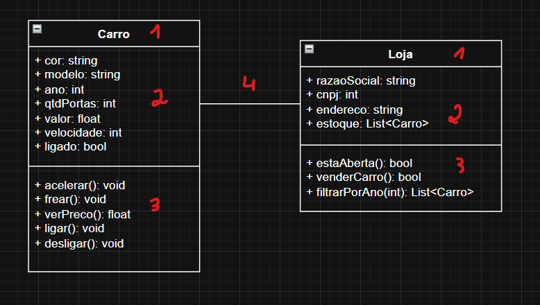

> DATAS IMPORTANTES  
> 06/04/2026: MA1  
> 13/04/2026: P1  
> 25/05/2026 MA2  
> 01/06/2026 P2

# 1. Apresentação da disciplina

A disciplina será ministrada utilizando C#, aplicando conceitos de Orientação a Objetos que se estedem a qualquer linguagem que a suporte.

# 2. Introdução a Orientação a Objetos (OO)

As principais entidades do paradimaga OO são:
* **Classe**: vem da palavra "classificação". São moldes que agrupam características em comum na regra de negócio.
* **Atributos**: são as características que a classe possui.
* **Métodos**: são as ações que as classes podem executar.

> Exemplo:  
> - Existem diversos tipos de veículos que circulam o mercado. Dentre deles, podemos classificar todos aqueles que são carros: possuem no mínimo quatro rodas. Esta é a classe "Carro".  
> - O carro é comporto por diversas características, como: cor, ano, marca, modelo, potência e quantidade de portas. Estes são alguns dos possíveis atributos da classe "Carro".  
> - Possuindo um carro, podemos ligar, buzinar e ligar os faróis. Essas ações (descritas por verbos) são os métodos da classe "Carro".

* **Objeto**: representa uma entidade (instância) da classe em questão.

> Exemplo: para o exemplo passado, um Wolkswagen Fusca, azul, de 1971 constitui um object da classe carro. Ele tem a sua própria forma de ligar, buzinar e ligar os faróis.

Portanto, o Paradigma Orientado a Objetos (POO) diz respeito a programação orientada a instâncias (objetos) das classes (que são apenas um molde abstrado para o objeto).

# 3. Diagrama UML (Unified Modeling Language)

O UML (Linguagem de Modelagem Unificada) é um diagrama que permite representar o modelo de classes, atributos e métodos relacionados a regra de negócio em que estamos construindo a nossa aplicação.

Existem diversos diagramas UML, o foco para a nossa aula é o diagrama de classes.

**Exemplo de diagrama de classe:**

Onde:
1. É o nome da classe.
2. São os atributos.
3. São os métodos.
4. Linha que representa a relação entre as classes.