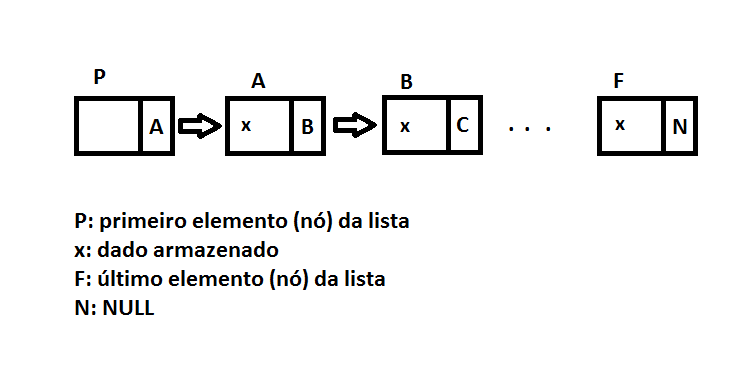

# Aula 01 - 12/08/2025
## Objetivos
- Apresentação da disciplina.
- Revisão geral.

## Algoritmos
É uma sequência de procedimentos computacionais que, dada uma entrada, devolve em uma saída esperada.

# Aula 02 - 19/08/2025
## Objetivos
- Tipo Abstrato de Dados e exercícios aplicados.

## TADs (Tipo Abstrato de Dados)
- É o conjunto de itens ou elementos (dados) que possui um conjunto de operações sobre esses elementos.
> Exemplo: pilhas.
- É o processo de abstração da orientação a objetos.

# Aula 03 - 26/08/2025
## Objetivos
- Fundamentos de Ponteiros; Recursividade e exercícios aplicados

# Aula 04 - 02/09/2025
## Objetivos
- Introdução às Estruturas Lineares - Pilha

# Aula 05 - 09/09/2025
## Objetivos
- Introdução às Estruturas Lineares - Fila e Fila Circular

# Aula 06 - 07/10/2025
## Objetivos
- Devolutiva de prova P1; Introdução à Lista Encadeada Dinamicamente

## Lista dinâmica encadeada
- É um conjunto de itens, todos de um mesmo tipo "Nó", que estão na memória do computador.
- É uma estrutura de dados genérica, e permite a inserção e remoção de um elemento em qualquer lugar da lista.
- Seus itens são nós. Compostos por um valor e um ponteiro que faz referência ao próximo valor/elemento da lista;

Exemplo:
```
struct NO {
    int valor;
    NO *prox;
}
```
- O último nó da lista encadeada aponta para o valor `null`;
- No exemplo acima, o `int` armazena o valor do elemento, enquanto o `*prox` indica qual é o próximo nó.
- O primeiro nó é conhecido como "cabeça da lista" (_head_), a depender da implementação. Ela aponta para o primeiro valor da lista.
- Se a _head_ está apontando para `null`, a lista está vazia.



- Operações
    - insercao(posicao)
    - remocao(posicao)
    - buscarElemento(posicao)
    - visualizarLista()
- Ela é chamada de "Dinâmica" por possuir a capacidade de alocar uma região de memória sob demanda.
- Pela sua estrutra, a busca neste modelo de lista é bastante custosa, pelo fato do dado não ocupar espaços contínuos na memória.

### Malloc
- `malloc`: "reserva uma posição de memória". Ele vai reservar a memória onde houver espaço.
- A devolução da função é um ponteiro do tipo `void`. Desta forma, precisamos ter o _cast_ para o tipo que está sendo usado na lista.

- `sizeof`: "devolve o tamanho da estrutura que desejamos alocar".

```
NO *p = (NO*) malloc(sizeof(NO))
```

# Aula 07 - 14/10/2025
## Objetivos
- Continuação sobre Listas Encadeadas Dinamicamente e exercícios aplicados

# Aula 08 - 28/10/2025
## Objetivos
- Problemas de Busca em Vetores Ordenados; Introdução Complexidade Algoritmica

# Aula 09 - 04/11/2025
## Objetivos
- Introdução aos Algoritmos de ordenação

# Aula 10 - 11/11/2025
## Objetivos
- Apresentação da estrutura tipo Árvore

# Aula 11 - 18/11/2025
## Objetivos
- Árvore Binária de Busca; Introdução a Grafos